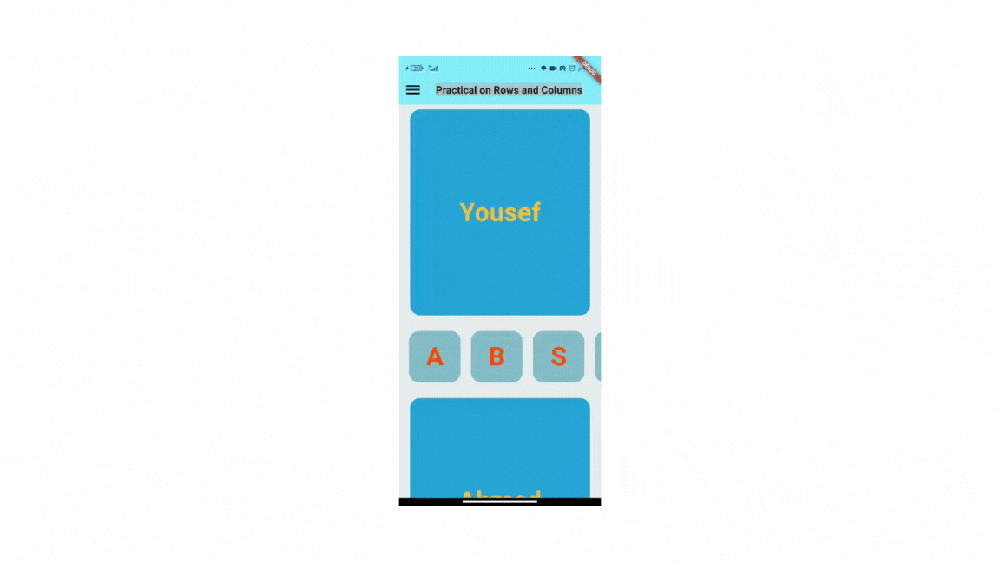

# Flutter Row and Column Practical

This Flutter project demonstrates the use of `Row`, `Column`, and `Container` widgets with styling.

The app displays a scrollable layout containing text inside containers, arranged in rows and columns.

## Features

- **AppBar** with a centered title and a menu icon.
- **Column layout** that stacks containers vertically.
- **Row layout** with scrollable containers arranged horizontally.

## Video

