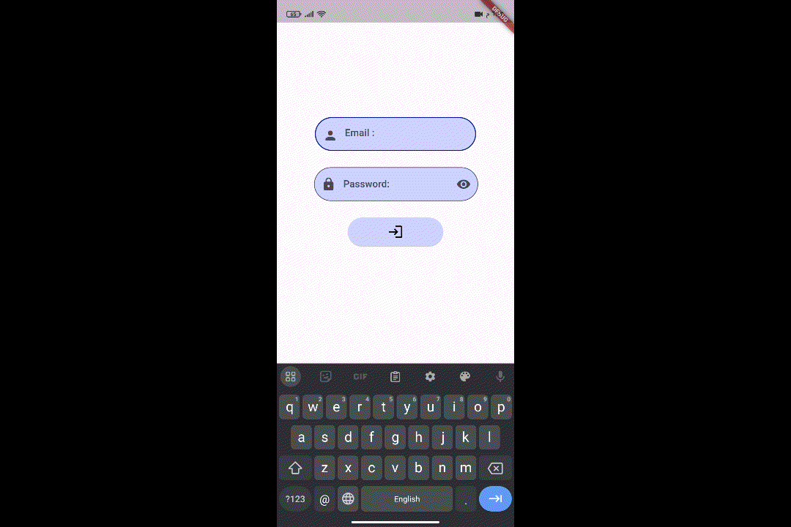

# Flutter Simple Login Page UI

This is a simple Flutter application that demonstrates a basic login UI with email and password input fields, along with a login button.

## Features

- **Email Input**: A text field for the user to input their email address.
- **Password Input**: A password text field with an eye icon to toggle visibility (icon currently non-functional).
- **Login Button**: A button that currently has no action assigned, but can be extended to handle user authentication.

## Video

