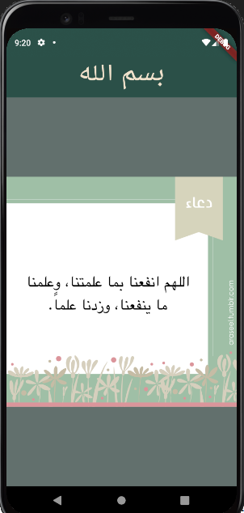

# Flutter Simple Project_01 

This is a simple Flutter application that displays a centered text in the AppBar and an image in the body.
## Screenshot

## Features
- A centered text "بسم الله" in the AppBar.
- Custom background colors for both the AppBar and the Scaffold.
- An image displayed in the center of the screen from the assets.
